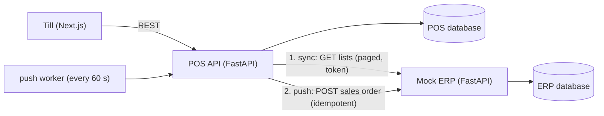

# my-pos: a point of sale that syncs with an ERP

A retail point-of-sale (till, orders, ERP sync) for a small chain of phone and
accessories stores, plus a **mock ERP** it integrates with. Built to show the part of POS
work that is usually hardest: keeping two systems in agreement when the network, the
other API, and the data all misbehave.

- **erp/**: mock ERP (FastAPI). It is the master for stores, registers, customers,
  customer groups, products, prices and stock. It issues client-credentials tokens,
  exposes only public UUIDs, paginates every list, and takes sales orders idempotently.
- **pos/**: POS backend (FastAPI + SQLAlchemy). Mirrors the ERP's master data into its
  own tables, sells, and pushes each sale back to the ERP.
- **web/**: the till (Next.js + Tailwind): product grid with barcode search,
  cart, customer-group discounts, cash/card/QRIS payment with change, order history with
  ERP push status, and a sync dashboard.

All data is generated with Faker; nothing here comes from a real company.



## Run it

### Without Docker (SQLite files)

```bash
python -m venv .venv && .venv/Scripts/pip install -r requirements-dev.txt   # bin/ on macOS/Linux

cd erp && ../.venv/Scripts/python -m erp_service.cli seed && cd ..
cd pos && ../.venv/Scripts/python -m pos_service.cli init-db && cd ..

# two terminals
cd erp && ../.venv/Scripts/python -m uvicorn --factory erp_service.main:create_app --port 8001
cd pos && ../.venv/Scripts/python -m uvicorn --factory pos_service.main:create_app --port 8000

# third terminal
cd web && npm install && npm run dev        # http://localhost:3000
```

Open **ERP sync → Sync now**, then sell on the **Till**. API docs: http://localhost:8000/docs
and http://localhost:8001/docs.

### With Docker (PostgreSQL)

```bash
docker compose up --build          # ERP :8001, POS :8000, Postgres :5432, push worker
cd web && npm install && npm run dev
```

### Try the failure paths

```bash
ERP_FAIL_RATE=1 docker compose up erp   # or set ERP_FAIL_RATE=1 before starting the ERP locally
```

Sales still go through at the till; they show as **pending** with the error and the next
retry time. Set the rate back to 0 and the worker (or **Orders → Retry due pushes**) sends
them, without creating duplicates.

### Tests

```bash
.venv/Scripts/python -m pytest
```

The POS tests run against the real ERP app in-process (FastAPI's TestClient is an
`httpx.Client`), so they cover the actual HTTP contract: tokens, pagination, status
codes, and JSON shapes.

## Design decisions

These come from problems I ran into integrating a real POS with a real ERP.

**The POS owns its primary keys.** Every mirrored table numbers its own rows; the ERP
record is linked by `erp_public_id` (a UUID). The ERP can renumber, merge, or hide its
internal ids without breaking a single foreign key in the POS.

**One generic mirror for every list** ([`pos/pos_service/sync.py`](pos/pos_service/sync.py)).
Shape the ERP row, match it on a key, insert or update only the fields that changed, then
deactivate the rows the ERP no longer returns (or delete them, for stock). Every change is
a `sync_event` row, so "why did this price change?" has an answer.

**An empty answer never empties a table.** If an API change or a bad filter makes the
ERP return 0 rows, the naive mirror deletes everything. Here the step is marked
`skipped` and the existing rows are kept.

**One bad row does not stop the run.** Each row is upserted inside a savepoint. A row
that fails is rolled back alone and logged with its error. A failed list (ERP down)
marks that step `failed` and the run carries on with the next list.

**Rows other data points at are deactivated, not deleted.** A customer removed in the
ERP still has orders in the POS.

**The till never waits for the ERP.** A sale is committed locally first; the push to the
ERP runs after the response (background task), and then from a worker on a backoff
schedule (1, 2, 4 … 60 minutes).

**Pushes are idempotent.** Every order has an `external_id` UUID. Before creating, the
POS asks the ERP whether it already has that id; the ERP also enforces it as unique. A
push whose answer was lost never becomes a duplicate sales order.

**Retry only what can succeed.** 5xx, timeouts, 429 and auth errors are retried; a 422
(e.g. the store was closed in the ERP) marks the order `failed` for a person to look at.

**Sync does not hand back sold stock.** Until the ERP has received a sale, its stock is
still higher than the POS's. The stock mirror subtracts units in unpushed orders, so a
sync in between doesn't make sold items reappear.

**Tokens renew themselves.** The ERP client caches its token, renews it early, and on a
401/403 fetches a new one and retries once.

**Prices come from the server.** The till sends product ids and quantities; prices,
discounts and totals are computed by the POS from synced data.

## Roadmap

- Alembic migrations (tables are created with `create_all` for now)
- Staff login (JWT), roles (cashier / admin), shifts with opening float and cash movements
- Customers created at the till and pushed to the ERP
- Promotions and vouchers
- PWA install and deployment on HTTPS
